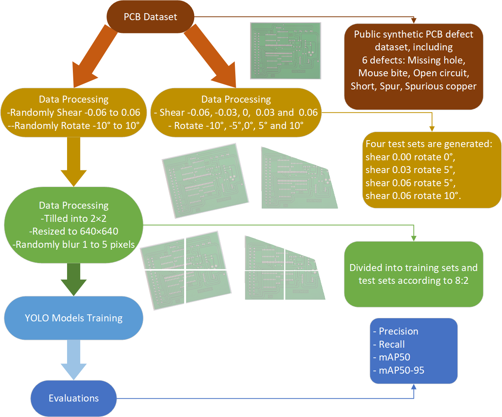

# VR-YOLO: Enhancing PCB Defect Detection with Viewpoint Robustness Based on YOLO




An Open Source Enhancement Algorithm for PCB Defect Detection Based on YOLOv8 Model
The YOLO image detection model has proven to be effective in detecting common defects in printed circuit boards (PCBs). However, traditional detection algorithms have high requirements for the angle, orientation, and clarity of the target images, leading to challenges in detecting small targets, slow model convergence, and poor algorithm generalization in practical applications. To address these issues, this paper proposes an enhanced PCB defect detection algorithm called SRI-YOLO based on the YOLOv8 model. The algorithm aims to strengthen the fusion of features at different scales and reduce interference from background information. The algorithm introduces the following innovations: 1) Diversified Scene Enhancement (DSE): augmenting the PCB defect dataset with diverse scenes to improve sample diversity and refine samples to enhance the learning effect for detecting small defect targets in PCBs with significant background variations. 2) Key Object Focus (KOF): incorporating angle loss considerations to enhance sensitivity to object orientation detection and introducing attention mechanisms to improve the model's recognition capabilities in terms of both channel and spatial dimensions. Experimental results demonstrate that the enhanced PCB defect detection algorithm achieves a mean average precision (mAP) of 98.9\% for original test images and 94.7\% for test images with simulated changes in perspective (horizontal and vertical shear coefficients of ±0.06 and rotation angle of ±$10^\circ$), showing significant improvements compared to the baseline YOLO model.

Learn more about environment configuration of our project, please refer to requirements.txt.

### Install
```
conda create --name VR-YOLO python=3.9
conda activate VR-YOLO
pip install -r requirements.txt
```
You can also choose to install from the YOLO project homepage [YOLO](https://github.com/ultralytics/ultralytics), but since the project is constantly evolving, you will need to replace some of the dependencies yourself:
```
pip install ultralytics
```

### Training
Run the following script to perfom training
```
cd ultralytics
python train.py
```
You can also find the pre-trained models here: model/SRSGS+CBAM+SIOU.pt.

### Inference
Run the following script to perfom inference
```
cd ultralytics
python test.py
```
You can optionally replace the model with one you trained yourself.

### Acknowledgements

This repo is largely based on [YOLO](https://github.com/ultralytics/ultralytics). Attention: This is a very iterative project. We are building on YOLOv8.
